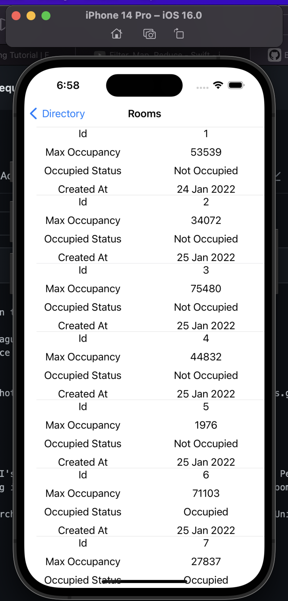

# DirectoryAppl
Run this application in XCode 14. If not able to find CoreNetwork and CoreUI layers, then goto the DirectoryApp(project folder) under Targets -> General -> Frameworks,Libraries and add them.

This is a directory app that allows staff to

Check all the colleagues contact details. Check which rooms in the office are currently occupied. The app reads API's for people and rooms information to display. In People, first the image and name is displayed for all the staff in collection view and on clicking it navigates into detail screen of employee.

In rooms, capacity and its occupancy status is displayed.

The app is developed in MVVM-C architecture. Uses coreUI and CoreNetwork packages. Unit tests are added at all modules level and UI tests are also added to the app.
